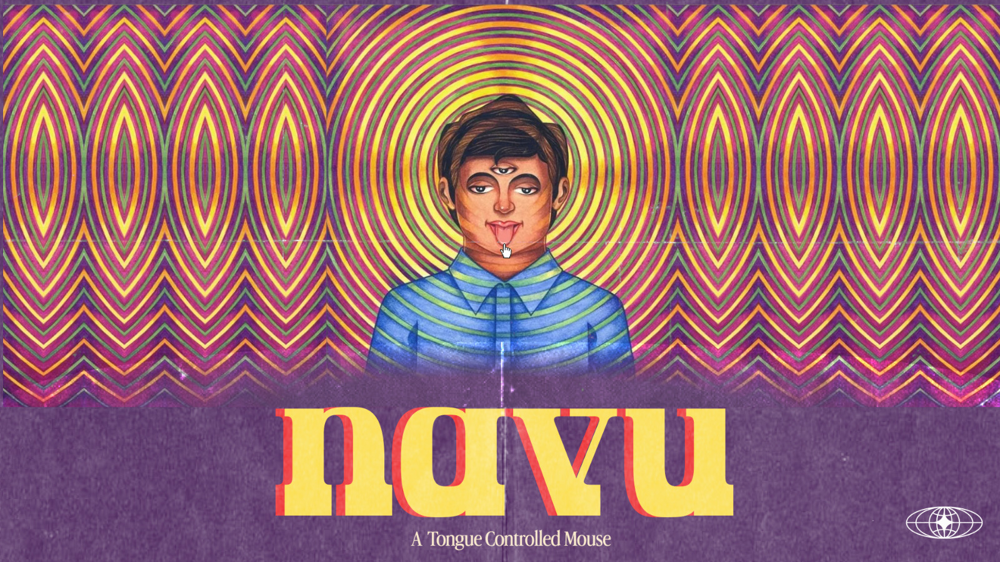

# Navu


## Basic Details
### Team Name: p3ak

### Team Members
- : Jonathan and Aryan

### Project Description
Real-time hands-free computer vision interface that tracks your tongue tip to smoothly control the system mouse cursor, with automatic cursor position locking and native Windows double-clicks when you close your mouth.

### The Problem (that doesn't exist)
Using your hands to move a mouse is way too conventional, boring, and efficient. Why use fingers or trackpads when your tongue can navigate Windows, browse the web, open applications, and execute double-clicks without touching any hardware?

### The Solution (that nobody asked for)
A non-contact vision algorithm powered by MediaPipe 3D Face Landmark tracking and OpenCV HSV/LAB color space segmentation. It maps sub-pixel tongue displacements to OS screen coordinates (`User32.SetCursorPos`) with exponential moving average (EMA) smoothing and triggers instant native Windows double-clicks upon mouth closure!

---

## Technical Details
### Technologies/Components Used
For Software:
- Python 3.13
- OpenCV 4.8+
- MediaPipe 0.10+ (FaceLandmarker 468 3D Landmarks)
- NumPy
- Pillow (PIL)
- Windows Native User32 CTypes API

---

### Implementation
For Software:

# Installation
```bash
pip install -r requirements.txt
```

# Run Unit Tests
```bash
python test_mouse_controller.py
```

# Run Application
```bash
python tongue_mouse_controller.py
```

---

### Project Documentation
For Software:

# Screenshots (Add at least 3)

*Minimal Pitch-Black Dark Mode HUD overlay showing real-time tongue tip reticle tracking and telemetry*


*Position locking telemetry and double-click feedback execution upon mouth closure*

# Diagrams
```
┌───────────────────────────┐     ┌───────────────────────────┐     ┌───────────────────────────┐
│   Webcam Video Stream     │ ──> │   MediaPipe FaceLandmarker│ ──> │  OpenCV HSV + LAB Segmentation │
└───────────────────────────┘     └───────────────────────────┘     └───────────────────────────┘
                                                                                  │
                                                                                  ▼
┌───────────────────────────┐     ┌───────────────────────────┐     ┌───────────────────────────┐
│ Windows Native Mouse API  │ <── │ Position Locking & Double │ <── │  Adaptive EMA Smoothing   │
│ (User32.SetCursorPos)     │     │ Click Handler on Close    │     │  & Sub-pixel Calibration  │
└───────────────────────────┘     └───────────────────────────┘     └───────────────────────────┘
```
*Architecture workflow diagram showing real-time video input processing to OS mouse execution*

---

### Project Demo
# Video

*Demonstration video showcasing real-time tongue movement tracking cursor navigation across desktop and double-clicking on icons via mouth closure*

# Additional Demos
- Interactive unit test suite: `python test_mouse_controller.py`

---

## Team Contributions
- **Aryan**: Idea, Improvement, Suggestions, Design and moral support.
- **Jonathan**: End-to-end architecture & design, MediaPipe + OpenCV dual-stage tongue detection pipeline, Windows User32 native mouse integration, position locking algorithm and double-click trigger.

---
Made with ❤️ at TinkerHub Useless Projects 


